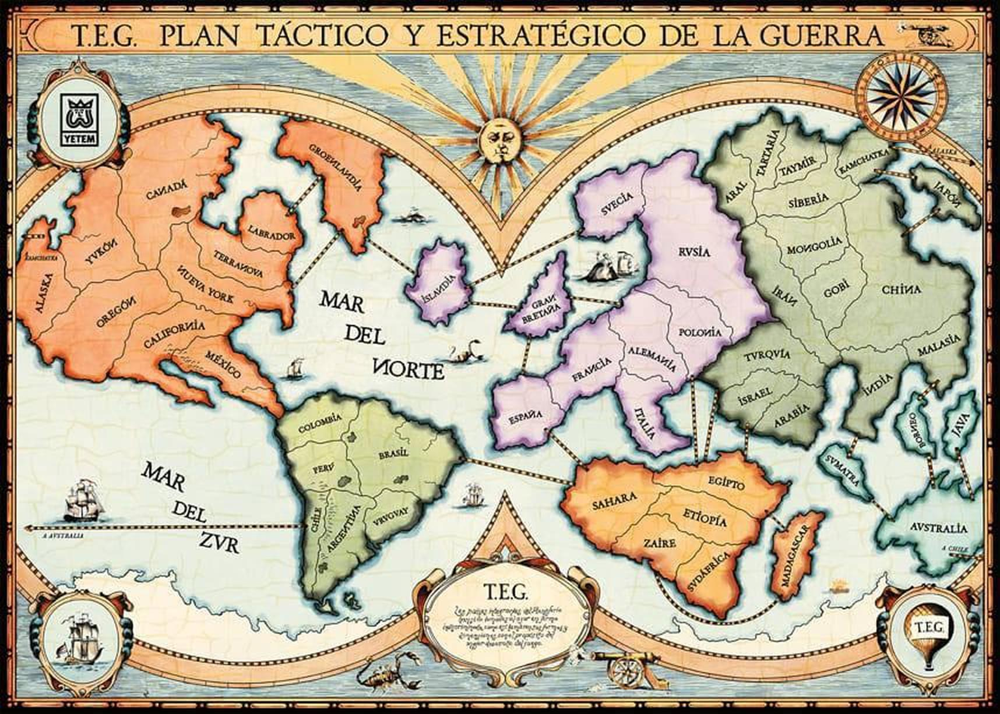

# TEG

TEG (Plan Táctico y Estratégico de la Guerra) es un juego de mesa que propone un conflicto bélico que tiene lugar sobre un mapa-tablero dividido en 50 países. 

Para empezar se reparten los 50 países entre los jugadores, quienes
ocupan sus dominios con fichas (ejércitos).
Cada jugador tiene el objetivo de conquistar al menos 30 países. Para ello el jugador deberá ampliar sus dominios y reordenar sus fuerzas, lo que exigirá emprender ataques y defenderse de ataques adversarios; agrupar y desplazar ejércitos.
La conquista de nuevos territorios le permitirá aumentar el número de ejércitos a su
disposición, otorgándole mayores chances para triunfar en los combates.
La mecánica de los combates se basa en el tiro de los dados, pero toma en cuenta
la cantidad de ejércitos de ataque y defensa. 

_En este problema presentamos una versión simplificada de TEG_  

## Elementos

- Mapa (en la forma de una imagen, `data/teg.jpg`, y de archivo de países por continente, `data/regiones_teg.json`)
- Un mazo de 50 cartas de países(en la forma de un archivo json, `data/cartas.json`). Cada carta representa un país y le asigna una figura (globo, cañon o galeón).
- 6 dados (que Ud. deberá simular) 

## Inicialización

El juego acepta entre dos y seis jugadores. cada uno cuenta con 100 ejercitos al iniciar
el juego.

- Se mezclan las cartas de los 50 países y se reparten entre los jugadores. Cada jugador coloca un ejército de su color en los países que obtuvo en el reparto de cartas. 
  > En el caso en que jueguen 3, 4 o 6 personas, sobrarán dos cartas. En ese caso, cada jugador arroja un dado, y las cartas sobrantes se entregan a los jugadores que obtengan los dos puntajes mayores.

- Finalizada la fase anterior, se juntan todas las cartas del mazo nuevamente.
- A continuación, cada jugador agrega 5 ejércitos (fichas) en sus países.
- Luego, cada jugador agrega 3 ejércitos (fichas) en sus países.

> En todo momento del juego, los 50 países del mapa deben estar ocupados.
> 
> En ningún momento pueden haber en un mismo país ejércitos de distinto color.

Al finalizar la inicialización, cada jugador tendrá una colección de países ocupados con ejércitos de su color.

## Turno de cada jugador

En cada turno, el jugador puede:

- ATACAR países ajenos.
- REAGRUPAR sus fuerzas.
- Si con sus ataques conquistó al menos un país, SOLICITAR una carta de países.

### ATACAR países ajenos

Un jugador puede atacar desde un país que ocupa a otro si:

- El país atacante es limítrofe con el país atacado (o están unidos por puentes, como Polonia-Egipto, o Chile-Australia)
- Si el país atacante tiene $n_a$ ejércitos, y el país atacado $n_d$, debe cumplirse que $n_a +1 \ge n_b$.
- No se puede atacar desde un país que tiene un sólo ejército.

#### Desarrollo del ataque

- El jugador anunciará el ataque indicando el país atacante y el atacado.
- Tomará tantos dados como ejércitos tiene en el país atacante, hasta un máximo de 3 dados.
- El jugador defensor tomará tantos dados como el país atacado, hasta un máximo de 3 dados.
- Ambos jugadores arrojan sus dados. Cada jugador ordena sus dados de mayor a menor (si el número de dados que arroja cada jugador es diferente, se descartan aquellos sobrantes de menor valor).
- Se comparan los dados de a pares, de mayor a menor.

*EJEMPLO 1*: Supongamos que el ataque es de Francia (“Verde”) a España (“Rojo”) y ambos contendientes juegan con tres dados cada uno, y que los resultados son:

| VERDE | ROJO |  Resultado |
|-------|------|--------------|
| 5 | 4 | Gana el dado de “Verde”|
| 3 | 3 | Empate: gana el dado de “Rojo” (defensor).|
| 1 | 2 | Gana el dado de “Rojo”.|

En consecuencia, “Verde” retira 2 ejércitos de Francia y “Rojo” retira 1 ejército de
España.

*EJEMPLO 2*: Supongamos que “Verde” juega con 3 dados y “Rojo” con 2.

| VERDE | ROJO | Resultado                     |
|-------|------|-------------------------------|
| 6     | 4    | Gana el dado de “Verde”.      |
| 3     | 3    | Empate: gana “Rojo” (defensor). |
| 1     | -    | El tercer dado de “Verde” no se toma en cuenta. |

En consecuencia, cada jugador retira uno de sus ejércitos.

Si el jugador defensor "Rojo" no tiene más ejércitos en España, el jugador "Verde" debe pasar al menos un ejército a España desde Francia, y, a lo sumo, pasar dos ejércitos más.
Si el jugador "Rojo" tiene al menos un ejército en España, el país le continua perteneciendo.

> En cada turno, un jugador puede atacar tantas veces como quiera, o decidir no
> realizar ningún ataque. 

### REAGRUPAR sus fuerzas.

Reagrupar es pasar ejércitos de un país a otro limítrofe, también propio.

Finalizada la etapa del ataque, el jugador podrá reagrupar fuerzas, pasando ejércitos
entre países propios y _limítrofes_, siempre dejando al menos una ficha en cada país.

### SOLICITAR carta de países

Si el jugador conquistó uno o más países, retira una carta de países del mazo.

- Si la carta retirada corresponde a uno de sus propios países, tiene derecho a agregar dos ejércitos en dicho país.
- El jugador conserva la carta. Si el país de la carta retirada no es propio, _pero es conquistado en un turno posterior_, tiene derecho a agregar dos ejércitos en el momento en que se conquiste.

> Los jugadores conservarán las cartas que van solicitando en cada turno. En el evento en que posean tres cartas con figuras iguales, o tres cartas con figuras distintas, podrán **canjear** dichas cartas por ejércitos, con el siguiente criterio:
>
> 1º canje . . . . . . . . . . . . . . . . . . . . . . . . . . . . 4 ejércitos
>
> 2º canje . . . . . . . . . . . . . . . . . . . . . . . . . . . . 7 ejércitos
>
> 3º canje . . . . . . . . . . . . . . . . . . . . . . . . . . . . 10 ejércitos

## Fin de los turnos

Una vez que se termina la ronda de turnos de todos los jugadores, cada jugador podrá agregar una cantidad de ejércitos igual a la mitad de los países que domina, en cualquiera de ellos.

## El problema

Se pide entregar un código que permita simular **una vuelta** del juego, tal como fue descripta en los párrafos precedentes.

- Ordene y clasifique el código en funciones, clases y módulos.
- Escriba un script `main.py` que simule una vuelta del juego.

> A los efectos de mostrar el tablero con la distribución de ejércitos en el mapa,
se provee de la función `dibuja_ejercitos_en_pais` en el módulo `muestra_ejercitos.py`, que permite dibujar un círculo con un número en un determinado país, representando
la cantidad de ejércitos en el mismo. 

Entregue el código como un repositorio de GitHub, y compártalo con cursopython@ib.edu.ar.

> A los efectos de la corrección, se tomará el último _commit_ anterior a la fecha de entrega establecida.
